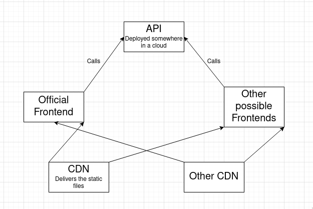

<!--  Might wanna take a look at this: https://stackoverflow.com/questions/2188884/how-can-i-mix-latex-in-with-markdown -->
# Petrol Station App - Computer Science Coursework by Cedric Borgers

## Analysis

Warning: In this essay I will be using metric units as well as euro since I am German, live in Germany and the program is intended for the German market because my potential users live there.

### Outline of the project

As my computer science course work I want to write an application for users who want to refill their car as cheap as possible. The user can choose a radius in that the application should search for petrol stations, the type of fuel that his car needs and how much fuel he wants to buy. Additionally there needs to be some way of specifying how much fuel the car roughly is using on 100km. 

The user needs to be presented with an app that shows his current position on a map as well as all fuel stations nearby in the chosen radius. Next to it there should be a list of the stations with their price, sorted by how much you would have to pay if you were to drive there (which uses up fuel -> costs money) and fill up your car with the specified amout of fuel.

### Stakeholders

My father always drives to petrol station that are relatively far away (5km-20km) since they are way cheaper than the petrol station that is only 500m away from our house.
I have always wondered if it actually makes sense to drive that far because you are also using petrol to get there which costs money. That is why this program should try to calculate how much petrol you are using to get to each petrol station and compare which station is cheapest with the fuel consumption in mind. This would be the perfect app for my father since he than can decide which petrol station is actually cheapest. I will stay in give him the app for feedback on a regular basis and improve on issues that he points out.

### Why is this problem perfect for a computational solution rather than something else?

This problem can be solved easiest by a program because of the following reasons:
- finding out prices of petrol stations without using some kind of program would be very tedious since you would have to visit every petrol station and petrol prices are changing regularly so you would have to drive there to find out their price which would waste fuel.
- calculating the fuel consumption to get to a petrol station can be done easily by a computer, it just has to apply a formula, while finding the fuel consumption by hand would require you to either drive there and find it out or finding the distance and then applying the formula by hand.

## Design
This solution consist of two different main parts:

The separation between the API Server itself and the server that delivers the static files (html, css and js files) ensures that making changes, when the solution is running in production, is easy since the logic is separeted from the frontend and how it looks. 
If I would use a Backend that delivers the static files and does the logic as well it wouldn't scale well if you had to deploy it on more servers to balance the load.
Additionally this ensures that you can have different frontends (mobile app and website for example) that have the same logic without having to implement it twice.
Another pro for this architecture is that you could have different CDNs so that you get the static files form the geographical nearest CDN with increases the load speed.

## Development