<!--  Might wanna take a look at this: https://stackoverflow.com/questions/2188884/how-can-i-mix-latex-in-with-markdown -->
# Petrol Station App - Computer Science Coursework by Cedric Borgers

## Analysis

### Outline of the project and Background

In Germany my family lives quite close to a petrol station that is however usually very expensive. My father thus tends to look for cheaper ones and often drives several miles to fill up one of his cars. I have often wondered whether these trips to the filling station aren't  more expensive than the amount he saved by filling up with the lower petrol price. I had a look at the available apps and websites, but none of them seemed to answer my question.
So I had the idea to write an application that will identify max. the 25 cheapest filling stations in  a predefined radius and set off the travel costs against the savings and so present to the user the optimized result in deciding which filling station would in fact be his cheapest option.
The user can choose the geographical radius, the type of fuel that his car uses and the amount of fuel he probably needs (e.g a complete filling, half a tank, a quarter, exact litres etc.). Additionally there needs to be some way of specifying the average mileage per 100km. 
The app then calculates which filling station within the predefined radius would be the best solution in terms of a price/performance ratio, i.e. it solves the problem if a cheaper filling station further away would be worth the trip compared to a more expensive one nearby or not. 

The user gets his current position shown on a live map as well as all fuel stations nearby in the chosen radius. Next to it there will be a list of the stations with their price, sorted by how much you would have to pay for the amount of fuel indicated if you were to drive there. 

### Stakeholders

As mentioned my father always drives to petrol stations that are relatively far away (5km-20km) from our home who offer a lower petrol price on their billboards than the one next door. So I have decided that my father is going to be my primary stakeholder. 
He travels a lot by car and so needs a lot of petrol on a regular basis, also in other regions than where we live. So it is imperative that the application is flexible enough to not only list the petrol stations around our home but to provide a mobile solution for the whole of Germany. As he does not travel by car outside of Germany but then would rather take a plane it appears sufficient that the app does not extend futher to other countries. Should I decide to extend this application after finishing the course project  and also allow external users I would consider a further geographical extension for additional countries, but for the current project this would go beyond the scope timewise and also technically.
Another feature he has asked for is that the application would be flexible enough to be able to switch between different mileage profiles for different car types ( e.g. luxury class vehicle, middle class vehicle)
My father uses several smartphones and a laptop with internet access. So with different operating systems (Windows and Android) for him it would be perfect if the solution worked on both platforms, that is why I decided to make it a website-based frontend which is platform-independent so you can use it on almost all phones (Android as well as iOS), tablets and PC alike as long as they have a modern browser.

I will stay in touch with him and show him the app for feedback on a regular basis as I develop it and improve on issues that he considers to be impractical or not user-friendly enough.

### Why is this problem perfect for a computational solution rather than something else?

This problem can be solved easiest by a program because of the following reasons:
- finding out prices of petrol stations without using some kind of program would be very tedious since you would have to visit every petrol station and petrol prices are changing regularly so you would have to drive there to find out their price which would waste fuel.
- calculating the fuel consumption to get to a petrol station can be done easily by a computer, it just has to apply a formula, while finding the fuel consumption by hand would require you to either drive there and find it out or finding the distance and then applying the formula by hand.

### Similar solutions
Before starting with my own project I researched all available apps for a similar purpose on the German market. These are native mobile phone applications, and some provide an app as well as a website.
#### Tankerkönig:  
Screenshot of their startsite:
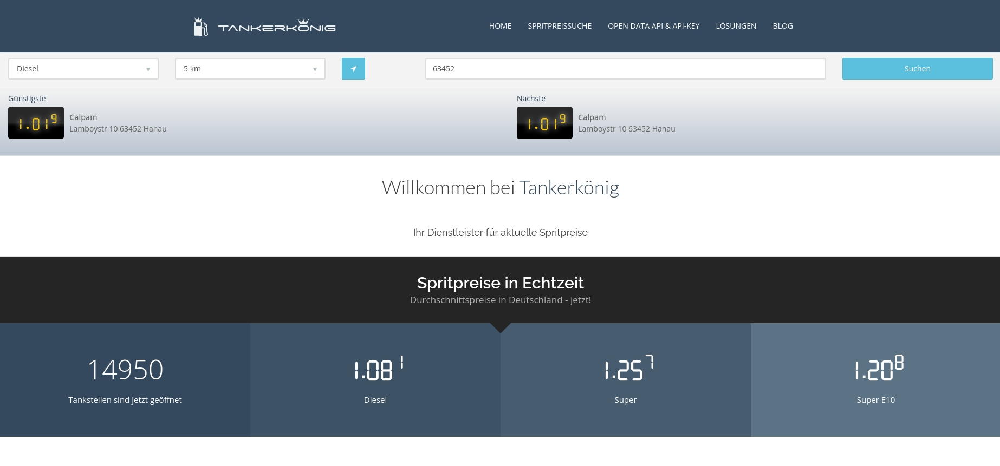
Screenshot of their results page:
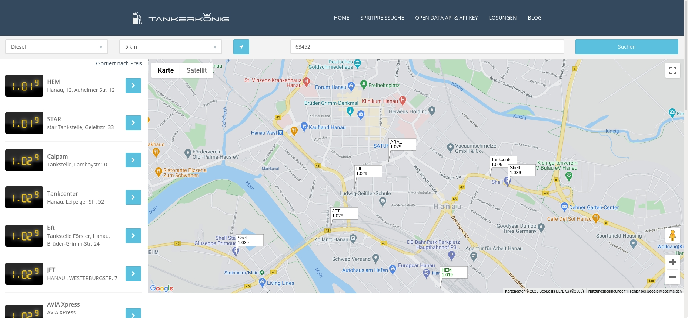
Website: https://www.tankerkoenig.de  
This website displays a map of the current users position with little flags indicating all available and open filling stations in the specified radius and their live price. Next to it there is a list of all the stations sorted by price or distance. The selected start location is rather basic, no exact address can be put in, but only a postcode. This is makes the app rather inexact since postcodes usually cover areas of several squarekilometers.
However this site has one big advantage which is that they expose a public API, used by my project.

#### T Online:  
Screenshot of their startsite which is also the results page:
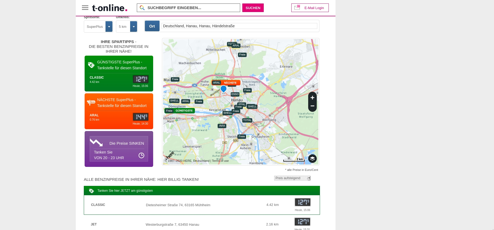
Website: https://tanken.t-online.de/  
Like the Tankerkönig webpage this also displays a map with all available petrol stations within a selected radius, their price for the selected fuel and if they are open, all centered around the selected starting point. This point however can be an exact address or it can try to work out your geolocation by itself if you grant the permission. This makes it a lot more precise and therefore useful than the Tankerkönig webpage. Additionally, like the Tankerkönig website it displays a list of all petrol stations sorted by price or distance. This website highlights the cheapest station and the nearest station out of all the found stations. 

#### TankenTanken:  
Screenshot of their startpage:
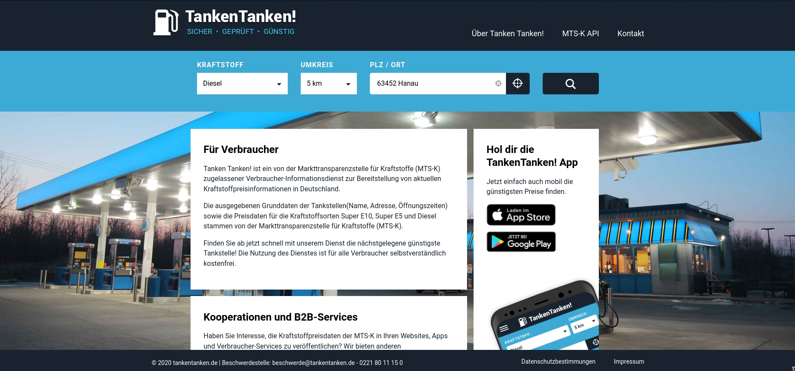
Screenshot of their results page:
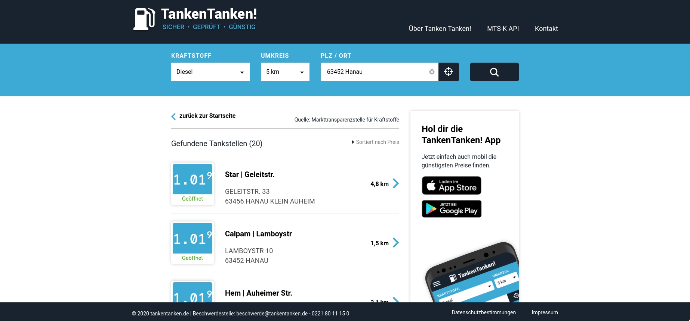
Website: https://tankentanken.de/  
Like the two previous webpages this website displays a list of all open and available petrol stations in a given radius and their price. Unlike the other two this one lacks a map and only lists the name of the stations and their address so that in case one is unfamiliar with the area you might have trouble finding the station at all / you need another navigation app. If you click on a particular station on the list it will try to display a map with the location of the station, however this fails since they haven't set up the google maps API correctly.
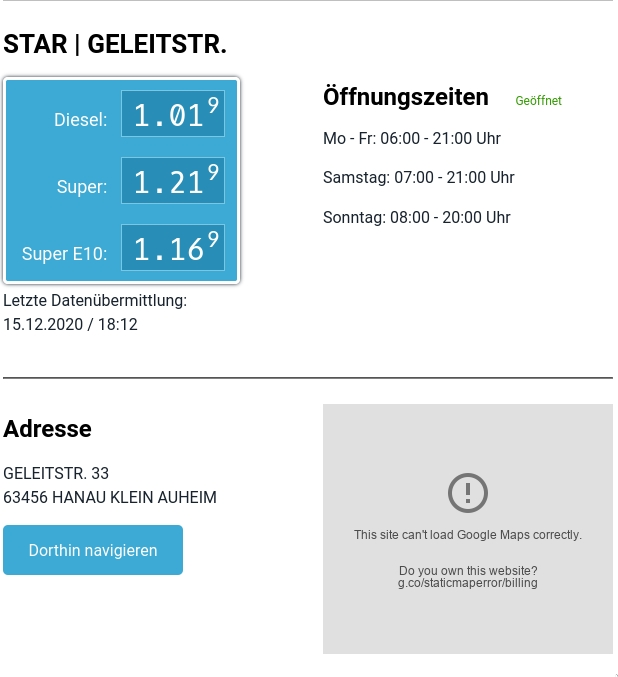  
They also offer an app with similar features:
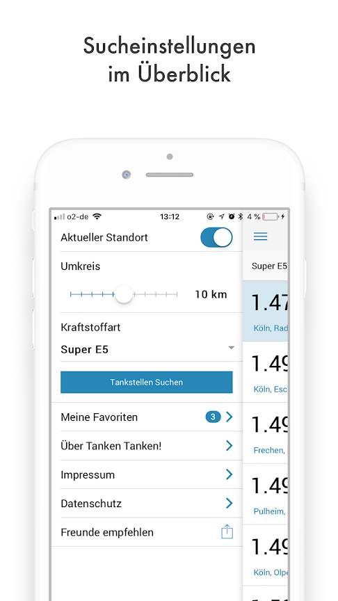

#### Ich Tanke:  
Screenshot of their startpage:
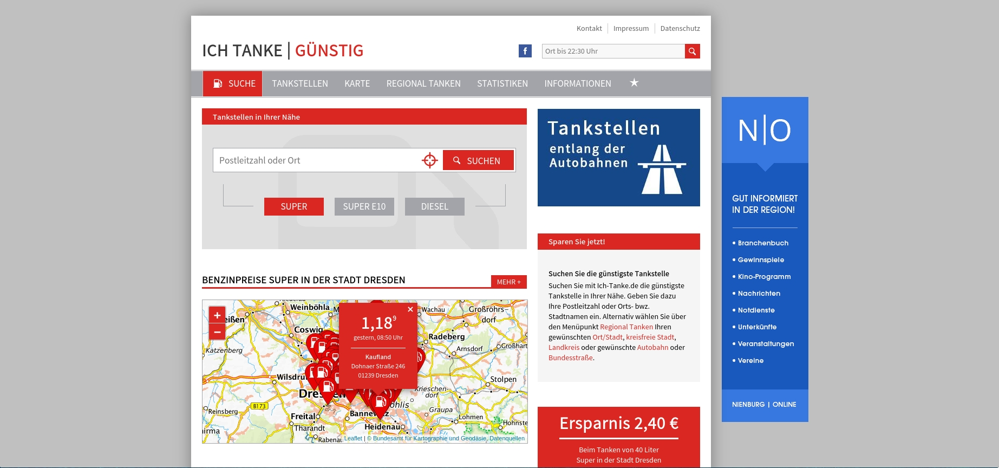
Screenshot of their results page:
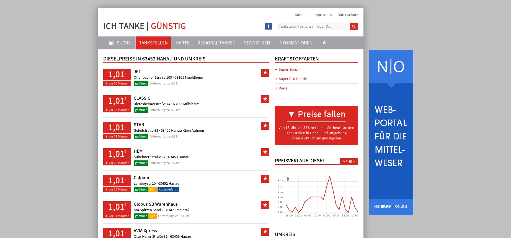  
Website: https://ich-tanke.de/  
This website offers a list of all petrol stations nearby, without the possibility to choose a radius, and their live prices. Like the one before it lacks a proper map, it only displays one if you click on "Karte" (German for "map"). You cannot specify an exact starting point, only a postcode. Unlike all the other ones you can't select the sorting method, it is presorted by price. It displays a graph of the current and past prices and gives a recommendation at what timeperiod it is wise to fill up your car during the day.
#### clever-tanken:  
Screenshot of their startpage:
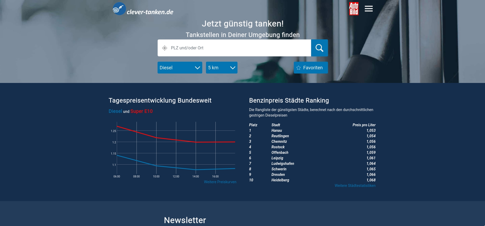
Screenshot of their results page:
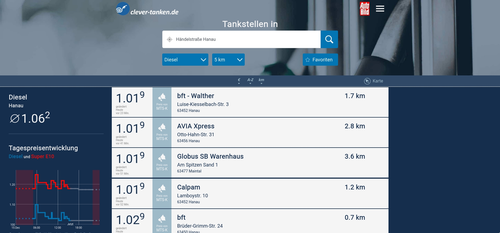
Website: https://www.clever-tanken.de/  
This seeems to be the most advanced website so far, like the other ones it enables the user to display a list of all petrol stations in a chosen radius from a starting point chosen by a street and unlikes the others allows to search for petrol stations with special fuels, among those are gas, Adblue, lorry diesel and even hydrogen. All the stations can be sorted by price, distance or alphabet. A map with all the stations can be displayed if necessary, as well as a price history of all the prices during the day for each station. A login function is available as well which enables users to report recently updated or wrong prices.
This website also offers an android app with the same features:  
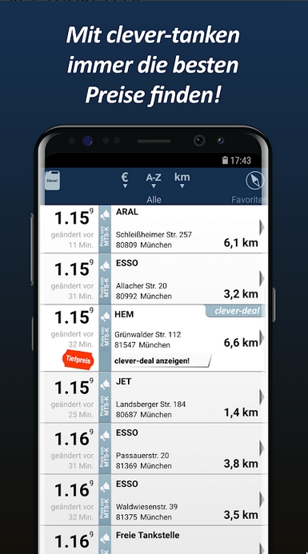

#### Analysis of existing solutions
All existing solutions basically comprise the following features:
- Search for open petrol stations using these parameters:
    - fuel type
    - geographical radius (some use the built-in GPS/ geolocation API provided by the browser, some use an address put in by the user)
    - starting point
- display a list of retrieved stations and sort them by price or distance
- display the current price for each station
- display a map of all stations (not all websites)
- display some sort of price history

All of these solutions don't compute anything, they get data from an API, put this data into a database and when you are using the site, they send you the data, sort it and present it with a nice UI.
They pretend to provide a solution for saving money for petrol spendings, however in fact they do not, because they don't address the fundamental problem of how to optimize the spending for petrol, since you might find the lowest price per liter, but you don't know if it's worth driving there.

### Essential features
<!-- TODO: Elaborate and justify all of this-->
Useful features sorted from most important to least:
- Find all petrol stations in a given radius
- Find their price and sort them by this parameter
- Calculate how much expensive it would be to drive to the selected station given that you have to refill the amount of fuel you used up as well as the amount of fuel you want to buy -> Then sort all the stations by this price

Possibly useful features that aren't a must have (again sorted from most important to least):
- User login function that saves the average fuel consumption of your car as well as your preferred settings
<!-- Either implemented without the actual login via local storage or with an actual DB-->
- Statistics that keep track of all your fuelling trips and how much fuel you actually used, to refine the fuel consumption model and give you some insights of how much money you already saved by using the app, etc

### Software and Hardware requirements
Software:
- Web browser with HTML5, ES5 support
<!-- TODO: #16 Add a Dockerfile-->
- Server with Python version > 3.8, pipenv or Docker installed

## Design
This solution consist of two different main parts:

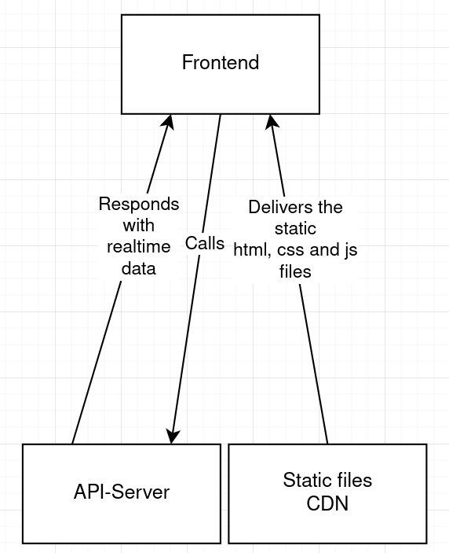

<!-- The separation between the API Server itself and the server that delivers the static files (html, css and js files) ensures that making changes, when the solution is running in production, is easy since the logic is separeted from the frontend and how it looks. 
If I would use a Backend that delivers the static files and does the logic as well it wouldn't scale well if you had to deploy it on more servers to balance the load.
Additionally this ensures that you can have different frontends (mobile app and website for example) that have the same logic without having to implement it twice.
Another pro for this architecture is that you could have different CDNs so that you get the static files form the geographical nearest CDN with increases the load speed. -->
In this diagram you can see one block that abstracts the frontend (the UI that user sees), another block that abstracts the API (the part that the user can't see and processes and delivers the data) and a last block that symbolizes the last part, a server that delivers the static files for the frontend (html, css and js files).

This very basic architecture can be implemented in two different ways:
- the API running on a different server than the static file CDN, which can speed up the load speed of the frontend since you can have different CDNs to have proper load balancing.
<!--TODO: Maybe add some explainations regarding geo load balancing and API less data, CDN lots of simple data -->
- API-Server that also delivers the static content. This will make the load speeds a bit slower, but makes deployment a lot easier, since you just have to deploy one program.

## Development

## Footnotes
Please note: In this essay I will be using metric units as well as Euro since I am German, living in Germany and the program is intended for the German market because my potential users are living there.